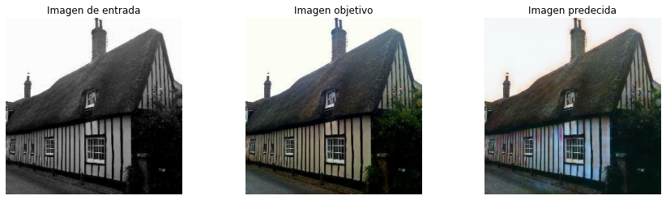
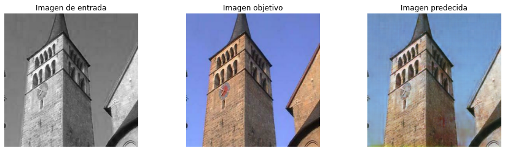
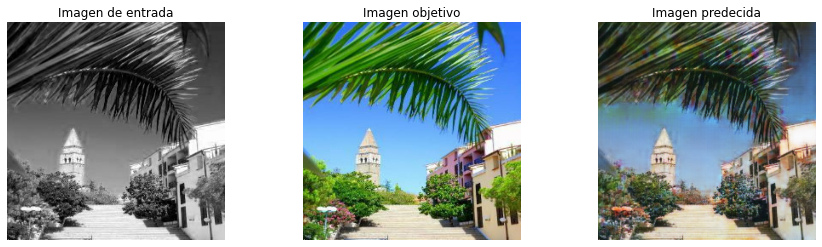
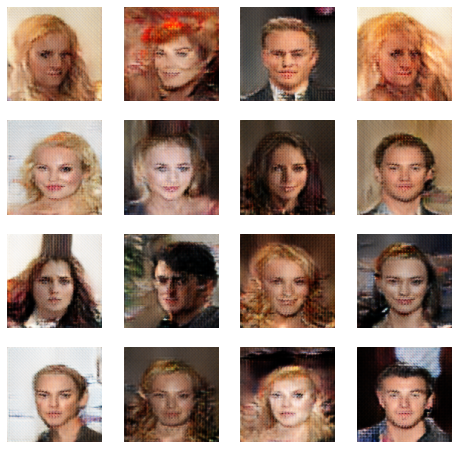

## Argenis Gómez - Proyectos en Deep Learning

Mi nombre es Argenis Gómez. Soy Ingeniero en Telecomunicaciones y Data Scientist residente en Argentina.

He desarrollado habilidades en Deep Learning y estoy certificado en Tensorflow. ([_Link a certificado_](https://www.credential.net/313eb6f7-4a64-4ce0-b20f-62625d615898))

Entre mis principales cualidades está el trabajo en equipo, el profesionalismo y el entusiasmo para siempre seguir creciendo profesionalmente.

### [Proyecto 1: Imágenes de blanco y negro a color](https://github.com/argenis-gomez/Imagenes-BN-a-Color.git)
#### Descripción:
A través de una arquitectura Pix2Pix agregaremos color a imágenes en blanco y negro.

* Se tomaron imágenes a color aleatoreamente de Google y se convirtieron a escala de grises para ser usadas como input del modelo.
* Se utilizaron 6000 imágenes con resolución de 256x256.
* El modelo fue entrenado por 100 épocas, obteniendo resultados bastante satisfactorios.

### [Proyecto 2: Fake Faces](https://github.com/argenis-gomez/Fake-Faces)
#### Descripción:
Utilizando una arquitectura GAN se creó un Generador de rostros artificiales.

El proyecto incluye una plataforma que permite generar rostros artificiales y descargarlos.

* Se utilizaron 40000 imágenes del dataset CelebA.
* Las imágenes tienen una resolución de 128x128.
* El modelo se entrenó por 300 epocas.

### [Proyecto 3: Clasificador de animales](https://github.com/argenis-gomez/Clasificador-de-animales)

### [Proyecto 4: Traductor](https://github.com/argenis-gomez/Traductor)

### [Proyecto 5: Clasificador de tweets](https://github.com/argenis-gomez/Clasificador-de-Tweets)

### [Proyecto 6: Clasificador de motos](https://github.com/argenis-gomez/Clasificador-de-motos)

### [Proyecto 7: Assault](https://github.com/argenis-gomez/Assault)
