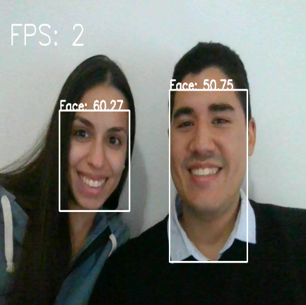

## Argenis Gómez - Proyectos en Deep Learning

Mi nombre es Argenis Gómez. Soy Ingeniero en Telecomunicaciones y Data Scientist residente en Argentina.

He desarrollado habilidades en Deep Learning y estoy certificado en Tensorflow. ([_Link a certificado_](https://www.credential.net/313eb6f7-4a64-4ce0-b20f-62625d615898))

Entre mis principales cualidades está el trabajo en equipo, el profesionalismo y el entusiasmo para siempre seguir creciendo profesionalmente.

---

## Todos mis proyectos

---

### [YOLOv5: Real time face detection](https://github.com/argenis-gomez/facedetection.git)
#### Descripción:
Utilizando YOLOv5 se creaó un detector de caras y con OpenCV se realizó una aplicación para detectarlas en tiempo real.

* Se etiquetaron las imagenes utilizando la plataforma de [Roboflow](https://roboflow.com/).
* Fue entrenado con casi 500 imágenes de 512x512 y por apenas 50 epocas.

---

### [Imágenes de blanco y negro a color](https://github.com/argenis-gomez/Imagenes-BN-a-Color.git)
#### Descripción:
A través de una arquitectura Pix2Pix agregaremos color a imágenes en blanco y negro.

* Se tomaron imágenes a color aleatoreamente de Google y se convirtieron a escala de grises para ser usadas como input del modelo.
* Se utilizaron 6000 imágenes con resolución de 256x256.
* El modelo fue entrenado por 100 épocas, obteniendo resultados bastante satisfactorios.

---

### [Traductor](https://github.com/argenis-gomez/Traductor)
#### Descripción:
Utilizando Transformes se desarrolló un traductor de inglés a español.

Con Steamlit se creó una plataforma que permite ingresar el texto en inglés y luego ser traducido a español.

* El traductor solo traduce de inglés a español, no es capaz de traducir de español a inglés.
* Al no disponer de suficiente entrenamiento se optó por utilizar un modelo más pequeño que el original.
* El modelo solo fue entrenado por 20 épocas, por lo tanto aún tiene un margen de mejora.

---

### [Clasificador de motos](https://github.com/argenis-gomez/Clasificador-de-motos)
#### Descripción:
Utilizando una arquitectura Xception se desarrolló un clasificador de motos.

Se creó una plataforma en Streamlit que permite cargar imágenes y clasificarlas en 9 clases diferentes. La plataforma tiene un sistema de feedback que permite al usuario verificar si la imagen fue clasificada correctamente y las guarda en background para reentrenar el sistema posteriormente.

* Los datos fueron scrapeados de MercadoLibre utilizando Scrapy. Se obtuvieron aproximadamente 15000 imágenes entre las diferentes clases.
* El clasificador funciona con 9 clases (Calle, Chopper, Cross, Cuatriciclos, Deportivas, Enduro, Naked, Scooters y Touring).
* Utilizando Keras-Tuner se obtuvieron los mejores parámetros para entrenar el modelo.
* El modelo principal tiene una precisión del 93% en imágenes nuevas.

---

### [Assault](https://github.com/argenis-gomez/Assault)
#### Descripción:
Usando DQN, se entrenó un agente que aprendió a jugar el juego de Atari 2600 Assault.

* El agente fue entrenado por 100 episodios.
* El agente es capaz de alcanzar una recompensa de 400+.

---

### [Clasificador de animales](https://github.com/argenis-gomez/Clasificador-de-animales)
#### Descripción:
Utilizando una arquitectura EfficientNetB0 se desarrolló un clasificador de animales.

Se creó una plataforma que permite cargar imágenes de animales y clasificarlas. La plataforma tiene un sistema de feedback que permite al usuario verificar si la imagen fue clasificada correctamente.

* El clasificador funciona con 10 tipos de animales (Perros, Gatos, Mariposas, Ardillas, Arañas, Vacas, Elefantes, Gallinas, Ovejas y Caballos).
* La idea detrás del mecanismo de feedback es guardar las imágenes dadas por el usuario con sus respectivas etiquetas para mejorar el modelo posteriormente.

---

### [Clasificador de tweets](https://github.com/argenis-gomez/Clasificador-de-Tweets)
#### Descripción:
Utilizando Conv1D se desarrolló un clasificador del sentimiento de Tweets en inglés.

Se creó una plataforma con Streamlit que permite ingresar el Tweet en inglés y luego clasificar el sentimiento.

---

### [Fake Faces](https://github.com/argenis-gomez/Fake-Faces)
#### Descripción:
Utilizando una arquitectura GAN se creó un Generador de rostros artificiales.

El proyecto incluye una plataforma que permite generar rostros artificiales y descargarlos.

* Se utilizaron 40000 imágenes del dataset CelebA.
* Las imágenes tienen una resolución de 128x128.
* El modelo se entrenó por 300 epocas.

---

### [Heart attacks prediction](https://github.com/argenis-gomez/Heart-attacks-prediction.git)
#### Descripción:

Se realizó el análisis exploratorio de los datos, para daterterminar los principales motivos de un ataque al corazón.

* Se utilizó keras-tuner con RandomSearch para determinar los mejores HP.
* El modelo alcanzó el 90% de precisón sobre el dataset de pruebas.

##### Variables discretas

##### Variables continuas

---
## Contacto
* LinkedIn - [Argenis Gómez](https://www.linkedin.com/in/argenisgomez/)
* GitHub - [argenis-gomez](https://github.com/argenis-gomez)
